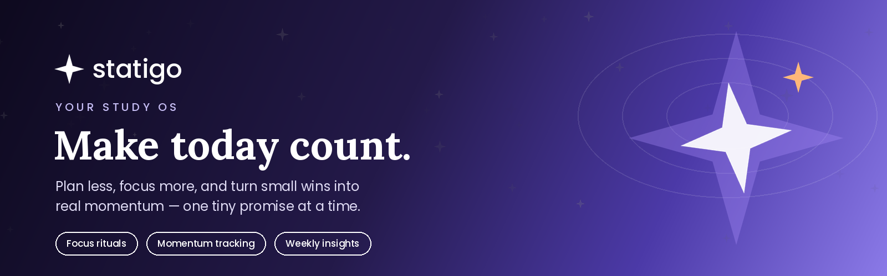

<h1 align="center">Statigo</h1>

<p align="center">
  
</p>

[](LICENSE)

---

Developed and managed by - Nimish Varshney © 2026


## About

Statigo is a minimal Vite-based static app scaffold with a tiny Express server for local development. This repository contains the application source you can clone, install, and run locally.

## Animated Preview

The header above is an animated typing SVG. You can add more visual flair by embedding animated SVGs or GIFs in this `README.md`.

## Quick Start

Clone the repo and install dependencies:

```bash
git clone https://github.com/nimishvarshneyofficial/Statigo.git
cd Statigo
npm install
```

Run the dev environment (starts `server.js` and `vite`):

```bash
npm run dev
```

Or run just the server:

```bash
npm start
```

Build for production:

```bash
npm run build
```

## Screenshots

<p align="center">
  
</p>

- Feature explainer: `assets/screenshots/feature_explainer.png`
- Mockup overview: `assets/screenshots/mockup_overview.png`
- Sign-in mockup: `assets/screenshots/mockup_signin.png`
- Premium mockup: `assets/screenshots/mockup_premium.png`
- Showcase collage: `assets/screenshots/showcase_collage.png`
- Social preview: `assets/screenshots/social_preview.png`
- Logo gradient: `assets/screenshots/logo_gradient.png`

View a browsable gallery/site at `/docs` (GitHub Pages from `docs/`).

## Notes

- The file `data/database.json` is excluded from the repo via `.gitignore` for privacy. If you need to include a sample database, create a `data/sample-database.json` and update your server to fallback to it.
- This project uses `vite` and React; Node 18+ and npm are recommended.

## Contributing

Pull requests and issues are welcome. If you add features, update this `README.md` with usage examples and screenshots or animated previews.

## License

This project is released under the MIT License — see [LICENSE](LICENSE).

# Statigo